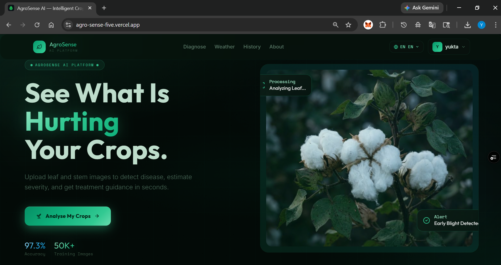
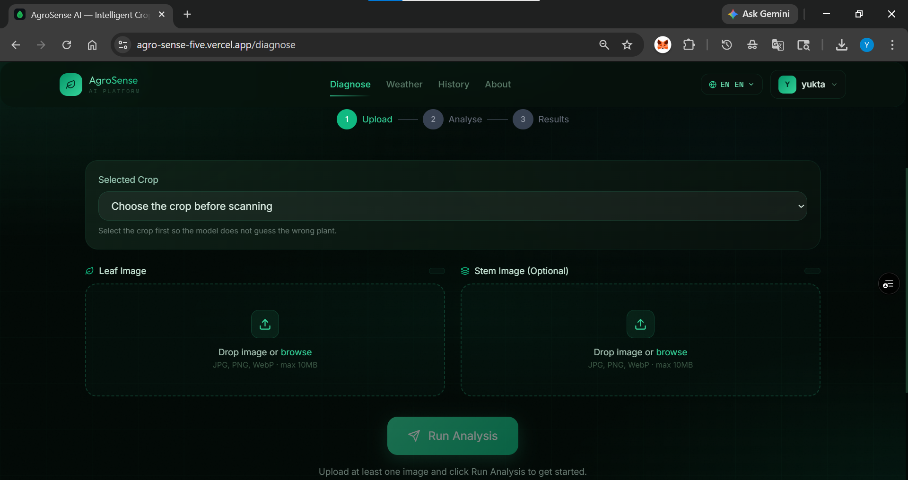
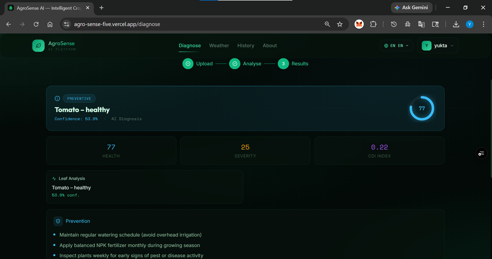
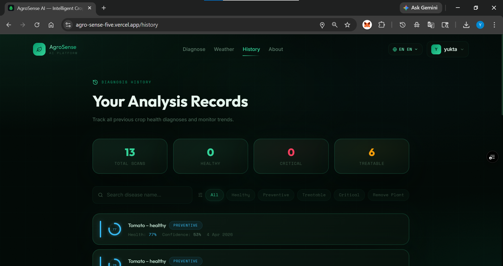

# 🌱 AgroSense AI — Intelligent Crop Health Platform

A full-stack ML-powered crop disease detection system. Upload leaf and stem images to get instant disease classification, severity estimation, Color Deviation Index (CDI), and targeted treatment recommendations.






## ✨ Features

- **Multi-Organ Analysis**: Simultaneous leaf & stem image analysis
- **MobileNetV2 CNN**: State-of-the-art CNN fine-tuned on 50,000+ crop disease images
- **Color Deviation Index**: Proprietary CDI metric for plant stress quantification
- **Adaptive Fusion**: Weighted decision fusion of leaf, stem and CDI signals
- **8-Language Support**: Full UI localization in English, Hindi, Marathi, Telugu, Tamil, Kannada, Bengali, Spanish
- **PDF Reports**: Download detailed analysis reports as PDF
- **Crop-Specific Analysis**: Select supported crops for targeted diagnosis
- **Real-Time Weather**: Integrated weather data for disease risk assessment

---


## 🚀 Quick Start

### Prerequisites
- Node.js 18+
- Python 3.10+
- MongoDB Atlas account (optional — works without it using in-memory storage)

---

### 1. Frontend Setup

```bash
cd frontend
npm install
npm run dev
```

Frontend runs at: `http://localhost:5173`

---

### 2. Backend Setup

```bash
cd backend

# Create virtual environment
python -m venv venv
source venv/bin/activate        # Windows: venv\Scripts\activate

# Install dependencies
pip install -r requirements.txt

# Configure environment
cp .env.example .env
# Edit .env and add your MONGO_URI (optional)

# Start the server
python app.py
```

Backend runs at: `http://localhost:5000`

---

### 3. Model Setup (Optional)

The backend includes a statistical fallback predictor that works without a trained model. For production accuracy:

**Option A — Download pre-trained model:**
1. Download `leaf_disease_model.h5` (place in `backend/models/`)
2. The model auto-loads on backend startup

**Option B — Train your own model:**
```bash
cd backend

# Download PlantVillage dataset from Kaggle:
# https://www.kaggle.com/datasets/emmarex/plantdisease
# Extract to ml/datasets/PlantVillage/

python train_model.py --data_dir ml/datasets/PlantVillage --epochs 30
```

Training takes ~2-3 hours on GPU, ~8-12 hours on CPU. Google Colab (free GPU) is recommended.

---

## 📊 ML Model Details

- **Architecture:** MobileNetV2 + Custom Classification Head
- **Input:** 224×224 RGB images
- **Output:** 38-class softmax (PlantVillage dataset classes)
- **Training:** 2-phase transfer learning (head → fine-tune top 50 layers)
- **Augmentation:** Rotation, flip, zoom, brightness, shift
- **Target Accuracy:** >95% on PlantVillage validation set

---

## 📝 License

MIT License — Free for educational and commercial use.

---

**AgroSense AI** — Built with ❤️ for precision agriculture
